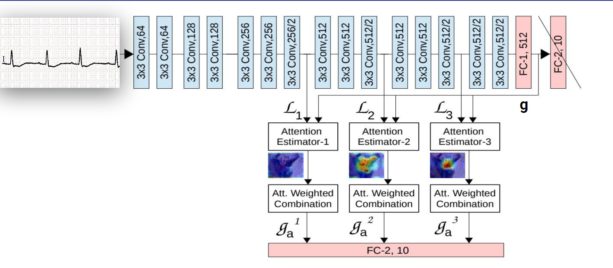

# Heart-Condition-Classification-from-ECG-images
Our objective is to classify a human heart's condition into 1 of 5 categories using deep learning and ecg image dataset. The categories are as follows:

1. Normal Heart
2. Abnormal Heart
3. Myocardial Infarction
4. History of Myocardial Infarction
5. Covid-19 Affected


<br/>

## **Dataset**
<br/>

[ECG Signal COVID 500](https://www.kaggle.com/datasets/marcjuniornkengue/covid500hz)

[ECG Images dataset of Cardiac and COVID-19 Patients](https://www.sciencedirect.com/science/article/pii/S2352340921000469?via%3Dihub)

<br/>

## **Data Preprocessing**
<br/>

Python's ***```pillow```*** package is used for data preprocessing. The steps are the following:

1. Each ECG image has 13 leads which are cropped by coordinates and separated as 13 leads
2. Grayscaling the cropped images
3. Inverting the cropped images
4. Dilating the cropped images
5. Resizing the cropped images to 64x64

<br/>

## **Model**

<br/>

We have explored 6 different models for this project. The models are as follows:

1. CNN 2D
2. CNN 3D
3. Attention with LSTM Network
4. Hybrid Network (CNN + Attention-LSTM)
5. AttentionVGG
6. Time Distributed CNN

<br/>


## **Best Model**
<br/>

AttentionVGG is the best model for this project. The architecture of the model is as follows:

<br>

<p align="center">
   
</p>

<br/>

## **Training**
<br/>

Each of the six models are trained for 20 epochs with a batch size of 16. The training is done on Kaggle GPU T4x2 environment. The codebase is in the ```Sricpts/Final_Codebase``` folder.

<br/>

## **Results**
<br/>

After training, each model is evaluated on the test set. The results are as follows:

| Model | Accuracy |
| --- | --- |
| CNN 2D | 0.982 |
| CNN 3D | 0.989 |
| Attention-LSTM | 0.887 |
| Hybrid Network| 0.953 |
| AttentionVGG | 0.994 |
| Time Distributed CNN | 0.98 |

<br/>

<!-- ## **Comparison**
<br/>

The following table shows the comparison of the AttentionVGG model with the other state-of-the-art models. -->

<!-- | Model | Accuracy | -->

<!-- <br/> -->

## **References**
<br/>

[State-of-the-art Models data](https://www.sciencedirect.com/science/article/abs/pii/S0020025520310069)

[Learn to Pay Attention](https://arxiv.org/pdf/1804.02391.pdf)

<br/>

## **Contributors**

#### [Md. Tanzim Azad](https://github.com/TanzimAzadNishan)

#### [Prantik Paul](https://github.com/prantik-paul-99)
